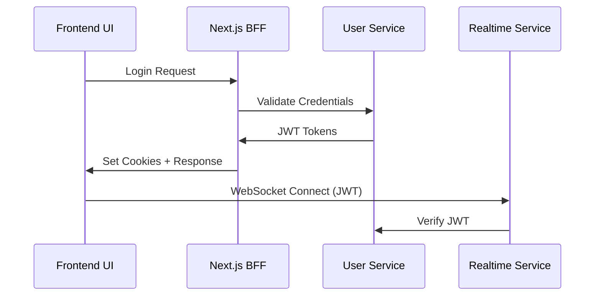

# Quix Messenger (Monorepo)

A modern, full-stack real-time messaging application built with a microservices architecture. Features include user authentication, friend management, real-time messaging, user presence tracking, and file uploads.

## 🏗️ Architecture Overview

### Services Architecture
```
┌─────────────────┐    ┌─────────────────┐    ┌─────────────────┐
│     Frontend    │    │  Realtime-TS    │    │  User Service   │
│   (Next.js)     │◄──►│   (Node.js)     │◄──►│   (.NET Core)   │
│   Port: 3000    │    │   Port: 8081    │    │   Port: 6001    │
└─────────────────┘    └─────────────────┘    └─────────────────┘
         │                       │                       │
         └───────────────────────┼───────────────────────┘
                                 ▼
                    ┌─────────────────┐    ┌─────────────────┐
                    │     Redis       │    │   PostgreSQL    │
                    │   (Cache)       │    │   (Database)    │
                    │   Port: 6379    │    │   Port: 5432    │
                    └─────────────────┘    └─────────────────┘
```

### 📦 Services (in this repo)
- **`frontend`** — Next.js 15 app with BFF pattern (TypeScript, React 19, Tailwind CSS 4)
- **`realtime-service-ts`** — WebSocket gateway for real-time messaging (Express.js 4.18, Socket.io 4.8, Redis)
- **`user-service`** — ASP.NET Core service for authentication, user profiles, and friendships (PostgreSQL, EF Core)

### 🗄️ Data Stores
- **PostgreSQL** — Primary database for user data, friendships, messages
- **Redis** — Real-time user presence, session management, and caching
- **File System** — Avatar storage with configurable paths

## ⚙️ Tech Stack

### Backend Services
- **ASP.NET Core 9** — User service with Entity Framework Core
- **Express.js 4.18** — TypeScript-based realtime service with Node.js 18
- **PostgreSQL 16** — Primary database
- **Redis 7** — Cache and real-time data store

### Frontend
- **Next.js 15** — React-based frontend with App Router
- **React 19** — Latest React with modern hooks and features
- **Tailwind CSS 4** — Utility-first CSS framework
- **TypeScript 5** — Type-safe development
- **Socket.io Client 4.8** — Real-time WebSocket communication
- **Zod 3.25** — Runtime type validation
- **Axios 1.11** — HTTP client with interceptors

### Development & Deployment
- **Docker & Docker Compose** — Containerized deployment
- **ESLint & TypeScript** — Code quality and type checking
- **Makefile** — Build automation

## 🧠 Frontend Architecture (BFF Pattern)

The frontend implements a Backend-For-Frontend (BFF) pattern using Next.js API routes:

### API Proxy Layer
- **Route Structure**: API routes under `frontend/src/app/api/**` proxy to backend services
- **Unified Proxy**: Single helper `src/lib/proxy.ts` handles all backend communication
- **Examples**: 
  - `/api/chats` → `USER_SERVICE_URL/Chat/getChats`
  - `/api/online/[userId]` → `REALTIME_URL/online/:userId`
  - `/api/realtime/user/[userId]/presence` → `REALTIME_URL/user/:userId/presence`

### Security & Validation
- **Input Validation**: Each route validates query/body with Zod schemas
- **Consistent Errors**: Unified error shape `{ message, details? }`
- **JWT Authentication**: Bearer token-based auth with automatic refresh
- **CORS Handling**: Proper cross-origin resource sharing

### Authentication Flow


### Real-time Communication
- **Socket.io Client**: Token-based authentication for WebSocket connections
- **Automatic Reconnection**: Handles connection drops and token refresh
- **Presence Tracking**: Real-time user online/offline status and last seen timestamps
- **Message Flow**: Real-time message delivery with offline support

### Key Frontend Paths
```
src/
├── app/
│   ├── api/**              # BFF API routes (proxy layer)
│   ├── (protected)/        # Authenticated pages
│   └── globals.css         # Global styles
├── lib/
│   ├── proxy.ts           # Unified proxy helper
│   ├── hooks/data/        # Data fetching hooks
│   ├── realtime/          # Socket.io workflows
│   ├── mappers/           # DTO → Domain type mapping
│   ├── types/             # TypeScript definitions
│   └── schemas/           # Zod validation schemas
└── components/            # Reusable UI components
```

## 🚀 Features

### ✅ Implemented
- **Authentication** — Login/logout/register with JWT tokens and automatic refresh
- **User Profiles** — Profile viewing, editing, avatar upload with file storage
- **Friendships** — Send/accept/reject friend requests, friend lists
- **Real-time Messaging** — WebSocket-based chat with Socket.io
- **User Presence** — Online/offline status and "last seen" timestamps
- **Message History** — Persistent message storage with pagination
- **File Uploads** — Avatar storage with configurable paths and default asset migration
- **Containerization** — Full Docker Compose setup for development and deployment
- **Input Validation** — Comprehensive validation with Zod schemas
- **Error Handling** — Centralized error handling and logging

### 🔄 In Progress
- **Message Read Status** — Read receipts and message status indicators
- **Group Chats** — Multi-user conversations
- **Push Notifications** — Browser push notifications for new messages

### 📋 Roadmap
- **File Sharing** — Image/document sharing in conversations
- **Voice/Video Calls** — WebRTC-based calling features
- **Mobile App** — React Native mobile application
- **Admin Dashboard** — User and system management interface
- **Performance Optimization** — Caching strategies and database optimization

## 🔧 Setup & Development

### Quick Start with Docker
```bash
# Clone the repository
git clone <repository-url>
cd quix-messenger-monorepo

# Build all containers
make build

# Start all services
make up

# View logs
docker-compose logs -f

# Stop all services
make down
```

### Services will be available at:
- **Frontend**: http://localhost:3000
- **User Service**: http://localhost:6001
- **Realtime Service**: http://localhost:8081
- **PostgreSQL**: localhost:5432
- **Redis**: localhost:6379
- **PgAdmin**: http://localhost:5050

### Local Development (Frontend only)
```bash
cd frontend
npm install
npm run dev
```

### Development with specific services
```bash
# Start only database services
docker-compose up -d postgres redis

# Run user service locally
cd user-service
dotnet run --project UI

# Run realtime service locally  
cd realtime-service-ts
npm install
npm run build
npm run dev
```

## 🔐 Environment Variables

### Frontend Environment
The frontend expects these environment variables (via `.env` or container env):

```env
NEXT_PUBLIC_SOCKET_URL=http://localhost:8081/
NEXT_PUBLIC_USER_SERVICE_URL=http://user-service:7001/api
NEXT_PUBLIC_REALTIME_URL=http://realtime-service-ts:8080
NEXT_PUBLIC_AVATAR_HOST_PORT=6001
NEXT_PUBLIC_AVATAR_URL=http://localhost:6001/uploads/avatars/
NEXT_PUBLIC_PAGE_SIZE=20
```

### Realtime Service Environment
```env
JWT_SECRET=a-string-secret-at-least-256-bits-long
PORT=8080
USER_SERVICE_URL=http://user-service:7001
REDIS_URL=redis://redis:6379
```

### User Service Configuration
The user service uses `appsettings.json` for configuration:

```json
{
  "JwtSettings": {
    "Issuer": "http://localhost:5001",
    "Key": "a-string-secret-at-least-256-bits-long",
    "AccessTokenExpirationMinutes": 15,
    "RefreshTokenExpirationDays": 7
  },
  "ConnectionStrings": {
    "PostgresSQLConnection": "Host=postgres;Port=5432;Database=appdb;Username=appuser;Password=secret"
  },
  "FileStorage": {
    "AvatarStoragePath": "/var/lib/quix-messenger/avatars",
    "MigrateDefaultAssetsOnStartup": true
  }
}
```

## 📁 File Storage & Asset Management

### Avatar Storage Configuration
The user service uses configurable file storage for user avatars:

```json
{
  "FileStorage": {
    "AvatarStoragePath": "/var/lib/quix-messenger/avatars",
    "MigrateDefaultAssetsOnStartup": true
  }
}
```

### Features
- **Configurable Storage Path**: Set custom paths for different environments
- **Default Asset Migration**: Automatically migrates default avatars on startup
- **Docker Volume Support**: Persistent storage outside containers
- **Protected File Access**: Secure avatar serving through API endpoints

### Docker Volume Setup
```yaml
services:
  user-service:
    volumes:
      - avatar-storage:/var/lib/quix-messenger/avatars
      - ./user-service/UI/wwwroot:/app/wwwroot

volumes:
  avatar-storage:
    driver: local
```

### Development Setup
For local development, configure a local path:
```json
{
  "FileStorage": {
    "AvatarStoragePath": "C:\\temp\\quix-messenger\\avatars",
    "MigrateDefaultAssetsOnStartup": true
  }
}
```

## 🧭 Request Flow Architecture

### 1. Standard API Request Flow
```
UI Component → api.* call → Next.js API Route → Zod Validation → proxy() → Backend Service
                    ↓
          Response ← JSON Response ← Stream Response ← Backend Response ← Service Logic
```

### 2. Authentication Flow
```
Login Request → BFF Route → User Service → JWT Tokens → Set-Cookie → UI State Update
                    ↓
WebSocket Connect → Socket.io → JWT Verification → User Online Status → Redis Cache
```

### 3. Real-time Message Flow
```
UI Message Send → Socket.io Client → Realtime Service → Message Validation → User Service
                              ↓
Room Broadcast ← Socket.io Server ← Message Storage ← Database Update ← Service Response
```

### 4. Error Handling Flow
```
Service Error → Proxy Handler → Consistent Error Format → UI Error Boundary → User Notification
       ↓
401 Error → Axios Interceptor → Token Refresh → Retry Request → Success/Login Redirect
```

## 🔧 Development Workflows

### Adding a New Feature
1. **Backend**: Add endpoint to appropriate service (User/Realtime)
2. **BFF Layer**: Create proxy route in `frontend/src/app/api/`
3. **Frontend API**: Add method to `frontend/src/app/api/index.ts`
4. **UI Hook**: Create data hook in `frontend/src/lib/hooks/data/`
5. **Components**: Build UI components with proper error handling
6. **Validation**: Add Zod schemas for type safety

### Testing Strategy
```bash
# Unit tests (when implemented)
npm run test

# Integration testing with Docker
make up
curl http://localhost:3000/api/health
curl http://localhost:8081/health

# Manual testing
open http://localhost:3000
```

## 📊 Monitoring & Debugging

### Available Endpoints
- **Health Checks**: 
  - Frontend: `http://localhost:3000/api/health`
  - Realtime: `http://localhost:8081/health`
  - User Service: `http://localhost:6001/health`

### Logging
- **Realtime Service**: Winston with daily rotation and multiple log levels
- **User Service**: Serilog with console and file outputs
- **Frontend**: Next.js built-in logging and browser dev tools

### Database Management
- **PgAdmin**: Available at `http://localhost:5050`
  - Email: `admin@admin.com`
  - Password: `admin`
- **Redis CLI**: Access via `docker-compose exec redis redis-cli`

## 📈 Performance & Scalability

### Current Architecture Benefits
- **Microservices**: Independent scaling of user management and real-time features
- **Redis Caching**: Fast user presence and session data
- **Connection Pooling**: Efficient database connections with EF Core
- **BFF Pattern**: Reduced client complexity and improved security

### Optimization Opportunities
- **CDN Integration**: Static asset delivery optimization
- **Database Indexing**: Query performance improvements
- **Message Queuing**: Async processing for high-volume operations
- **Horizontal Scaling**: Load balancing across service instances

## 🤝 Contributing

### Development Setup
1. **Prerequisites**: Docker, Docker Compose, .NET 9 SDK, Node.js 18+
2. **Clone Repository**: `git clone <repo-url>`
3. **Start Services**: `make up`
4. **Development Mode**: Run individual services locally as needed

### Code Standards
- **TypeScript**: Strict mode enabled, proper type definitions
- **C#**: Follow .NET conventions, async/await patterns
- **React**: Functional components with hooks
- **Validation**: Zod schemas for runtime type safety
- **Error Handling**: Consistent error shapes across services

### Commit Guidelines
Follow the project's emoji-based commit convention:
- ✨ `feat`: New features
- 🐛 `fix`: Bug fixes  
- 📚 `docs`: Documentation
- ♻️ `refactor`: Code improvements
- ✅ `test`: Testing additions

## 🔒 Security Features

### Authentication & Authorization
- **JWT Tokens**: Secure token-based authentication
- **Automatic Refresh**: Seamless token renewal
- **HTTPS Ready**: Production-ready SSL configuration
- **CORS Protection**: Configured cross-origin policies

### Input Validation
- **Runtime Validation**: Zod schemas for API inputs
- **SQL Injection Protection**: EF Core parameterized queries
- **XSS Protection**: React's built-in sanitization
- **File Upload Security**: Type and size validation

### Data Protection  
- **Password Hashing**: Secure password storage
- **Session Management**: Redis-based session handling
- **Private File Access**: Protected avatar serving
- **Environment Secrets**: Secure configuration management

## � Support & Community

### Getting Help
- **Issues**: Report bugs and feature requests via GitHub Issues
- **Documentation**: Comprehensive README and inline code comments
- **Development**: Well-structured codebase with clear separation of concerns

### Roadmap Participation
The project welcomes contributions in areas like:
- Performance optimization and caching strategies
- Mobile app development (React Native)
- Advanced chat features (file sharing, voice/video)
- Admin dashboard and analytics
- DevOps and deployment improvements

---

## 📊 Project Stats

- **Languages**: TypeScript (65%), C# (30%), Others (5%)
- **Services**: 3 main services + 2 databases
- **API Endpoints**: 25+ REST endpoints + WebSocket events
- **Frontend Pages**: 15+ pages with responsive design
- **Docker Images**: 3 custom services + 3 infrastructure

---

*Built with ❤️ by the Quix team*
